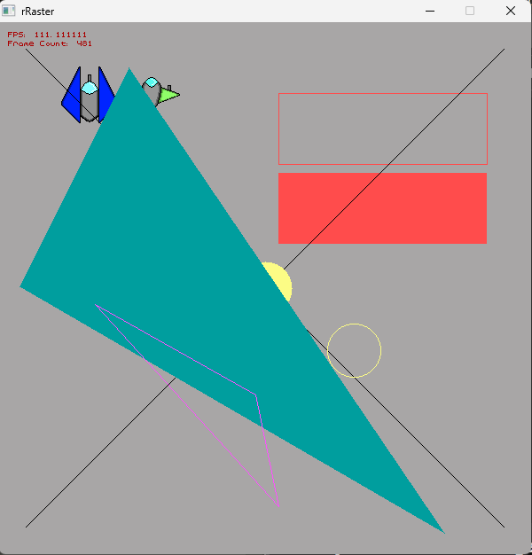
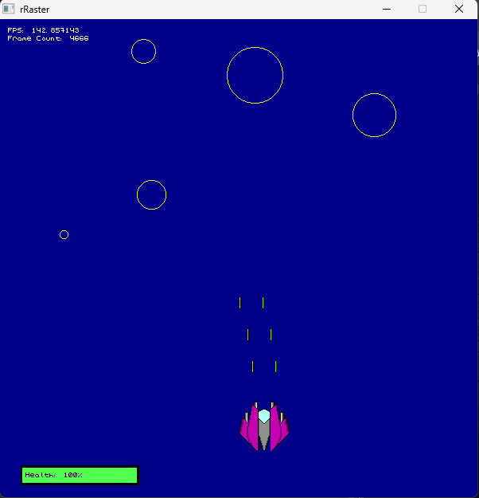

## rRaster

This is an SDL2 rasterizer in C++, the idea is to maybe use this for game prototyping or visualizing data in general. See main.cpp (in the function <code>render_graphics</code>) for some sample code.

## Screenshots

  
  

## Features

- Create Cross-Platform window
- Render individual pixels
- Color the window background
- Render AABBs (filled or not filled)
- Render lines (Bresenham's Line Algorithm, [source](https://youtu.be/y_SPO_b-WXk?si=SVX4SOGROpANxgFX))
- Render circles (Bresenham's circle ouline Algorithm, [source1](https://youtu.be/FTkO3ExDj3s?si=bIIEOSXufaHABDQi) and [source2](https://youtu.be/JtgQJT08J1g?si=K53YhH60jFwXi6FC)) (filled or not filled)
- Render Triangles [source](https://youtu.be/k5wtuKWmV48?si=3n6yzdB0qRcTjsqd) (filled or not filled)
- Render Images (with [stb_image.h](https://github.com/nothings/stb/blob/master/stb_image.h))
- Render Text (custom font, see <code>6x7_custom_font.png</code> in assets/fonts folder)

## How To Use

- Just clone this repo wherever you want.
- Open the command prompt on the cloned directory.
- Type <code>make run</code> and hit Enter.

## Technologies Used

- C++11
- Makefiles
- SDL2
- stb_image.h (for image loading)
